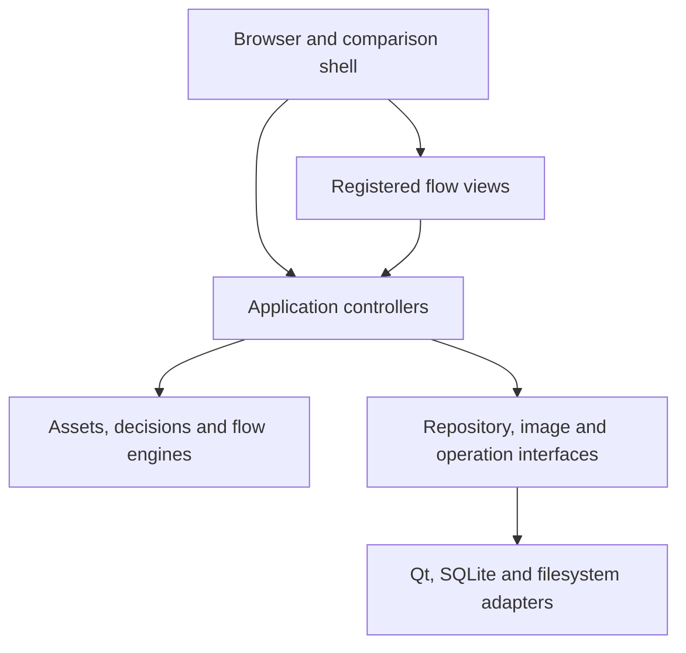

# Image collection culling utility — design specification

Revision: 0.2 · 10 September 2026 · Status: proposed design with confirmed requirements

This document specifies a new desktop utility. No application or GitHub repository has been implemented or tested yet. Statements labelled **required** come from the brief; other decisions are proposed defaults. Product name and application licence remain undecided.

## 1. Requirements and scope

| ID | Required behaviour |
|---|---|
| R1 | Run on Linux and macOS. |
| R2 | Implement the application in C++. |
| R3 | Open a directory and visually browse its images. Support contiguous ranges and arbitrary multiple selection. |
| R4 | Start a comparison flow on the selection and eliminate images from it. Eliminated images are marked for deletion. |
| R5 | Provide a versus tree: display two candidates at a time, eliminate one, and continue until one remains. |
| R6 | Provide a wall containing all selected images, including fullscreen use. Clicking an image eliminates it; the wall may rearrange. |
| R7 | Make additional comparison flows straightforward to add. Only versus and wall are in initial scope. |
| R8 | Use a GUI framework compatible with free and open-source software. |
| R9 | Manage dependency versions with vcpkg, build with CMake, and bootstrap vcpkg from CMake. |
| R10 | Prefer existing libraries for general-purpose functionality. |
| R11 | Display the JPG when a RAW/JPG pair exists. File operations must include its associated RAW files. |
| R12 | Host source on GitHub and test through GitHub Actions, including conventional unit tests and GUI tests. |
| R13 | Provide a comprehensive pre-commit setup, including clang-format and EditorConfig enforcement. |
| R14 | Run clang-tidy through CMake and enforce it in GitHub Actions. |
| R15 | Publish test coverage to codecov.io. |
| R16 | Associate JPG and RAW files in the same directory using identical filename stems; this arrangement is confirmed. |

Proposed initial scope: a local, single-user culling application, one open collection and one active comparison session per window. Linux x86-64 and macOS Apple Silicon and Intel are proposed build targets. Select the oldest supported operating-system versions after the first dependency/package smoke builds; a runner's OS version does not define the application's minimum OS version.

The first release supports JPG/JPEG previews and opaque RAW companions. RAW development, image editing, ratings, duplicate detection, cloud sync, a third comparison mode, and third-party binary plugins are outside the initial scope. Moving to Trash is the proposed eventual deletion action; ordinary comparison never modifies image files.

## 2. Recommended technology choices

Use **C++20, Qt 6 Widgets, CMake, Ninja, and vcpkg manifest mode**. Qt Widgets suits a desktop browser and custom comparison surfaces while keeping the user interface in C++. Use standard Qt controls around specialised image views. The framework supplies model/view infrastructure and a Graphics View framework for interactive graphical items. Widgets is available under free-software licences, including LGPLv3. [Qt Widgets documentation](https://doc.qt.io/qt-6/qtwidgets-index.html)

Prefer dynamically linked Qt builds. Select and record the application's own licence separately; distribution must account for the licences of the selected Qt modules and bundled dependencies. Avoid unnecessary Qt modules: their licensing is not uniform. [Qt licensing](https://doc.qt.io/qt-6/licensing.html)

| Responsibility | Proposed library or facility | Application-specific work |
|---|---|---|
| Windows, dialogs, menus, shortcuts | Qt Widgets | Browser, comparison shell, review screen |
| Collection list and selection | QAbstractListModel, QSortFilterProxyModel, QListView, QItemSelectionModel | Asset roles, filtering and stable-ID mapping |
| Image display and interaction | QGraphicsView/QGraphicsScene, QPainter | Image item, zoom policy and wall layout |
| JPEG decoding and orientation | QImageReader, JPEG plugin | Request scheduling, errors and preview selection |
| Image colour conversion | QImage/QColorSpace | Explicit colour policy and cache keys |
| Background work | QThreadPool/Qt Concurrent | Priority queues, cancellation and memory budget |
| Filesystem observation | QFileSystemWatcher, Qt filesystem classes | Pairing and reconciliation |
| Metadata persistence | Qt SQL with SQLite | Schema, transactions and migrations |
| Preferences and paths | QSettings, QStandardPaths | Settings definitions |
| Undo/redo | QUndoStack/QUndoCommand | Domain commands and persistence coordination |
| Trash | QFile::moveToTrash behind an adapter | Group planning, staging journal and recovery |
| Logging | QLoggingCategory | Categories and useful diagnostics |
| Unit, integration and GUI tests | Qt Test, CTest | Fixtures, scenarios and fault injection |

Use Qt Test for both non-GUI and GUI suites; a second general unit-test framework is unnecessary initially. It includes signal observation and item-model validation. [Qt Test](https://doc.qt.io/qt-6/qttest-index.html)

Do not introduce LibRaw, OpenCV, a metadata parser, or a separate JPEG decoder for the initial requirements. RAW bytes are companions, not a rendering input. If capture-time sorting or a detailed camera-information panel is added, select a metadata library then. Domain-specific pairing and comparison rules remain application code.

## 3. Central domain model

The unit of selection, rejection, and file operations is a **PhotoAsset**, not an individual file.

| Type | Essential fields | Meaning |
|---|---|---|
| Collection | ID, root, scan configuration, revision | A directory browsing context |
| PhotoAsset | stable ID, preview member ID, member IDs, pairing state, revision | One visible photo and all known associated files |
| FileMember | ID, role, original path, native identity where available, size, modification time | One physical JPG, RAW, or explicitly associated sidecar |
| PairingState | Resolved, JpegOnly, RawOnly, Ambiguous, Stale | Whether the group can safely participate in operations |
| Disposition | Neutral or Reject | Collection-level deletion mark |
| SelectionSnapshot | ordered asset IDs, membership revisions | Fixed input to a comparison |
| ComparisonSession | ID, flow ID/version, input snapshot, state, draft rejections, lifecycle | One independent culling attempt |
| OperationPlan | ID, immutable groups and member fingerprints, progress | Reviewed file-operation work |

Keep these states independent. For example, `Reject` describes intent; `Stale` describes pairing; `PartiallyStaged` describes an operation. Do not combine them in one large status enum.

Invariants:

1. One visible asset represents one resolved JPG and its zero or more RAW companions. Duplicate/ambiguous previews require resolution.
2. Comparison engines receive asset IDs and display metadata, never writable filesystem handles.
3. Eliminating a candidate changes draft rejection state only. Accepting the result creates deletion marks; physical operations are separate.
4. A survivor is not globally protected. It can be rejected by a later comparison.
5. An operation is planned for an entire asset, including every resolved member. No public application service accepts a JPG path as an independent deletion request.
6. An ambiguous or unexpectedly changed group cannot proceed to a physical operation.
7. A file member belongs to at most one resolved asset. Shared or conflicting associations block operations until resolved.
8. Model rows, sort positions and filenames are not stable asset identities.

## 4. Discovery and JPG/RAW association

### 4.1 Directory handling

Open a directory through the native folder picker or a command-line directory argument. Scan asynchronously and publish results in batches. The proposed default scans the directory itself; recursive scanning is an explicit option. Recursive mode preserves each relative directory in grouping keys.

Show one thumbnail per resolved asset, with a RAW badge and member count. Offer a diagnostic filter for RAW-only and ambiguous groups. A RAW-only entry has a placeholder and explanation; it is not rendered through a RAW embedded preview. A damaged JPG likewise produces a visible error rather than an automatic RAW fallback.

Natural filename ordering is the proposed initial sort. Freeze the ordered selected IDs when starting a flow. New scan results, thumbnail completions and later sort changes must not change an active bracket or wall's logical input.

Streaming scan results may show provisional thumbnails, but classify an asset as Resolved or JpegOnly only after its association scope has finished enumeration for the current scan generation. Provisional groups cannot start comparisons or operations. Otherwise a JPG encountered before its RAW would temporarily acquire incorrect membership.

### 4.2 Confirmed pairing rule

Pair within the same directory using the exact filename stem, with case-insensitive recognition of extensions. The user confirmed this directory and filename arrangement. Preserve actual filesystem paths. For example:

| Files discovered | Interpretation |
|---|---|
| `DSCF0123.JPG`, `DSCF0123.RAF` | One asset; show JPG; operations include both |
| `IMG_0123.jpeg`, `IMG_0123.CR3` | One asset; show JPEG; operations include both |
| `A.JPG`, `A.CR3`, `A.DNG` | One asset with two RAW companions; show both in review |
| `A.JPG` | JPG-only asset; valid if association scan found no companion |
| `A.RAF` | RAW-only diagnostic entry; excluded from visual comparison |
| `A.JPG`, `A.jpeg`, `A.RAF` | Ambiguous preview; require resolution before comparison/operations |
| `A.JPG`, `a.RAF` | Potential stem-case mismatch; flag as unresolved rather than silently discard the possible companion |
| `day1/A.JPG`, `day2/A.RAF` | Separate directories; never automatically pair |

An initial configurable extension list should cover common camera RAW filenames, including `.cr2`, `.cr3`, `.nef`, `.nrw`, `.arw`, `.raf`, `.orf`, `.rw2`, `.pef`, `.srw`, `.dng`, and `.raw`. This list recognises companion candidates; it makes no claim that their contents are supported for decoding. Unknown same-stem files appear in association diagnostics and must be explicitly classified before an otherwise questionable group can be operated on.

Detect case-folding and Unicode-normalisation collisions without rewriting filenames or merging assets on that basis. Preserve native path identity; if a platform filename cannot round-trip through the chosen path API, show an unsupported-path error and disable its operations.

### 4.3 Extensions to pairing

Define an `IAssociationResolver` independently of the comparison-flow interface. Later rules can map corresponding JPG/RAW directory trees or filename transformations. Configuration must yield deterministic groups and report conflicts. Avoid fuzzy timestamp or visual-similarity matching for operations.

Sidecars are not an explicit initial requirement. Model them as optional members now; propose associating unambiguous `stem.xmp` and `raw-filename.xmp` files if sidecar handling is enabled. Any enabled sidecar participates in the same operation group.

Do not follow file or directory symlinks for operations in the first release. Flag symlinks and hardlink aliases rather than accidentally operating on a second representation of the same entry. The source images are opened read-only during browsing.

### 4.4 External changes

Watch directories, debounce notifications, and rescan affected scopes. Also refresh on window activation and provide manual Refresh. A watcher is a hint, not authoritative file inventory; watch limits and renamed/removed paths require explicit handling. [QFileSystemWatcher](https://doc.qt.io/qt-6/qfilesystemwatcher.html)

If a RAW disappears after pairing, retain the expected member and mark the asset stale. Do not silently reclassify it as JPG-only. If a companion appears, invalidate pending operation plans. An affected comparison pauses until the group is refreshed or the session is restarted. Unrelated new assets never enter an active selection automatically.

## 5. Browser and common comparison shell

The browser contains the directory path, thumbnail grid, sort/filter controls, comparison menu, and a visible rejection count. Standard platform selection applies: Shift for ranges, Ctrl on Linux or Command on macOS for toggling individual items, and the platform Select All shortcut. Selection covers visible logical assets; launching a flow reports any excluded invalid or already-rejected items.

Each flow opens inside a shared comparison shell with an optional fullscreen presentation. The shell provides remaining/rejected counts, Undo, Redo, Finish, Pause and Discard. `Escape` leaves fullscreen first; otherwise it pauses and returns to the browser. It never silently applies or discards decisions.

The proposed session lifecycle is:

| Action | Effect |
|---|---|
| Start | Freeze eligible asset IDs and create a session-local draft |
| Eliminate | Update the flow and its draft rejection set; preserve original files |
| Undo/Redo | Restore the previous/next complete decision, including flow position |
| Pause | Persist the draft and return to the browser |
| Resume | Validate input identities and restore the draft |
| Finish | Atomically merge draft rejections into collection deletion marks |
| Discard | Remove the draft without changing previous collection marks |

A session can finish early. Only decisions actually made become rejection marks; unresolved candidates remain neutral. Existing rejected assets are excluded unless the user first unmarks them. Finishing a session does not erase marks from other sessions.

After finishing, select the survivors in the browser. This supports wall culling followed by versus without special coupling between those flows. Switching the flow implementation inside an unfinished session is not needed initially.

Use the same primary click meaning in both modes: **click the image to eliminate it**. In versus, also provide clearly labelled “Keep left” and “Keep right” buttons/shortcuts. A plain click is not also a zoom command. Use a separate Inspect action, such as Space on the focused image; click-and-drag pans in inspection mode and does not eliminate.

## 6. Flow A: versus tree

Build a deterministic single-elimination bracket from the frozen selection order. Use the next power-of-two bracket size and distribute byes in the first round; persist the actual bracket rather than regenerating it during undo or resume. Schedule ready matches by round, then bracket position. Do not repeat a winner against every remaining newcomer: the proposed interpretation of “tree” is a balanced tournament.

Exactly two real candidates are displayed for each match. A bye advances without showing a fake or empty opponent and without rejecting anything. With N valid candidates, completion requires exactly N−1 elimination decisions and leaves one survivor.

| Case | Defined behaviour |
|---|---|
| No eligible candidates | Cannot start; show the reason |
| One eligible candidate | Show it as the survivor; make no decisions |
| Odd or non-power-of-two count | Advance first-round byes automatically |
| Click left image | Reject left, advance right |
| Click right image | Reject right, advance left |
| Undo after advancing | Restore the exact match, its candidates and prior bracket state |
| New decision following Undo | Drop the abandoned redo branch |
| Finish early | Mark decided losers only |
| Complete | Show the survivor and rejection count; keep Finish/Undo available |

Both panes use equal available area, fit the entire oriented image, and never crop by default. Provide 100% inspection, independent pan/zoom, and an optional linked view using normalised image coordinates. Explain the distinction between equal zoom and equal framing when resolutions or aspect ratios differ. Full-resolution readiness must be visible when judging sharpness.

Disable decision input until both required previews are ready. A later high-resolution refinement must never swap candidate identities. Consume repeated key events and late clicks against a completed match so that one gesture cannot decide two matches.

## 7. Flow B: image wall

The initial wall fits all selected candidates into the available screen. Fullscreen hides browser chrome but retains an accessible compact control strip. Do not silently paginate or omit candidates when a selection is large; display smaller tiles and offer inspection or a user-selected scrollable enlarged view.

Use a deterministic equal-cell grid initially. For each candidate column count, compute the corresponding rows and available cell sizes; choose a layout that maximises the smallest fitted-image area, with stable tie-breaking. Fit each complete image into its cell, preserving aspect ratio and selection order. This small layout policy is application-specific; use Qt for geometry, rendering and events.

Two layout behaviours are proposed:

- **Reflow**, initially enabled: remove rejected candidates and enlarge/reposition survivors while preserving relative order.
- **Fixed positions**: leave a rejected placeholder until explicit Compact. This preserves spatial memory during rapid culling.

Finish may retain any number of survivors, including zero. The empty-wall view still offers Undo and Finish. This differs from the one-survivor completion rule of versus and must not be hardcoded into the common session controller.

Bind each gesture to an asset ID and layout revision at pointer press. Reject only if release still refers to the same eligible item and valid revision. Reflow starts after the gesture finishes. Suppress double-click continuation and input during relayout; require a fresh targeted gesture afterwards. Holding a key must not reject a sequence of tiles. Undo restores the prior candidate and deterministic position.

After a tile disappears, suppress repeat clicks in its former hit region for the platform double-click interval unless the pointer deliberately moves to another target. Finishing a layout animation alone must not rearm a second click at the same coordinates. Test this explicitly with realistic event sequences.

Keyboard navigation moves focus between tiles; Delete/Backspace rejects the focused candidate, Space inspects it, and the platform Undo/Redo shortcuts reverse decisions. Rejection, focus and errors need icons/text as well as colour. Custom graphics items must expose accessible names and actions; keyboard operation is mandatory.

## 8. Extensible architecture

Use a modular monolith with explicit CMake targets. Compile the initial flows into the application and register their factories. Extensibility means adding a flow module, registration and tests; it does not require a stable external binary-plugin interface.



| Target | Owns | Must not own |
|---|---|---|
| `cull_domain` | IDs, asset metadata, selection snapshots, pairing policy, flow contracts | Widgets, SQL connections, physical operations |
| `cull_application` | Session lifecycle, validation, disposition changes, operation planning | Concrete flow layouts or JPEG decoding |
| `cull_flow_versus` | Bracket state and transitions | Paths, SQL, other comparison modes |
| `cull_flow_wall` | Candidate-set state and transitions | Paths, SQL, other comparison modes |
| `cull_infrastructure` | Scan adapters, image service, repository, staging and Trash adapter | User selection or comparison policy |
| `cull_ui` | Browser, shared shell, image widgets, controller adapters | Direct image-file mutation |
| `cull_view_versus`, `cull_view_wall` | Mode-specific presentation and validated actions | Independent persistence or deletion |
| `cull_app` | Composition root and startup | Duplicated business logic |

Qt Core value types are acceptable in domain contracts to avoid parallel string/JSON/container abstractions. Domain and flow tests must run without a GUI application. The image-service and UI types remain outside these domain targets.

### 8.1 Flow contract

The following is an interface sketch, not a compiled implementation. The named payload/result types require concrete definitions during scaffolding.

```cpp
class IComparisonFlow {
public:
    virtual ~IComparisonFlow() = default;

    virtual FlowDescriptor descriptor() const = 0;
    virtual ValidationResult validate(
        const SelectionSnapshot& selection,
        const FlowOptions& options) const = 0;
    virtual FlowState initialise(
        const SelectionSnapshot& selection,
        const FlowOptions& options) const = 0;
    virtual TransitionResult reduce(
        const FlowState& state,
        const FlowAction& action) const = 0;
    virtual FlowSummary summarise(const FlowState& state) const = 0;
    virtual RestoreResult restore(const VersionedFlowState& saved) const = 0;
};
```

`FlowDescriptor` contains a stable string ID, display name, state-schema version, input-size constraints and supported actions. `FlowSummary` exposes remaining IDs, draft-rejected IDs, progress and whether the session may finish. Completion rules belong to the flow.

Use a versioned action envelope with a flow-local action name and validated JSON payload; each flow decodes this into its own typed action. State payloads are likewise owned by the flow. This avoids a common `variant<VersusState, WallState, ...>` that must change for every new mode. Only the flow implementation and its matching view understand mode-specific payloads.

Every action carries session ID and expected state revision. The controller rejects stale or duplicate actions before dispatch. A successful transition supplies new state and a reversible decision delta. The host validates that all affected IDs belong to the input, that remaining/rejected sets are consistent, and that the engine has not changed group membership.

Factories register an engine and its view under the same stable ID. The shell uses the registry to populate its comparison menu. Each view can use its own layout and controls while reusing the image canvas, loading service and action dispatch. A new flow never requires an additional `switch` in the browser, pairing resolver or operation executor.

Keep model transitions deterministic and free of I/O. Timers, random seeds, images and filesystem state are injected explicitly where needed. No randomised bracket order is required initially; if added, persist the seed and resolved order.

### 8.2 Shared controllers and threading

`CollectionController` coordinates scanning and the asset model. `SessionController` owns the active engine, state revision and undo stack. `DispositionController` applies/unapplies collection marks. `OperationController` owns review plans, execution and recovery.

Only the GUI thread mutates Qt models and widgets. Workers return values through queued delivery with collection/session generation IDs. Late results from an old directory or superseded image request are discarded. Decode workers never hold widget pointers. SQLite connections are owned and used on their assigned thread; operation work is serialised independently of thumbnail work.

### 8.3 Undo boundaries

Use Qt's undo framework for command ordering, redo invalidation and action state. Store domain-specific forward/inverse changes in commands: bracket path changes for versus and candidate position changes for the wall. Avoid copying the whole collection for each rejection. [QUndoStack](https://doc.qt.io/qt-6/qundostack.html)

The active session has its own undo stack. Finishing it creates one collection-level “Apply comparison rejections” command. Only one draft is active at a time, and changing collection marks is disabled while its view is active. The browser's Undo reverses a completed comparison's marks; it does not secretly reopen its view.

Proposed first-release limit: saved drafts and marks survive restart, but Undo/Redo history is retained only for the current process. Resume starts an empty undo stack at the restored draft state. Persisting/replaying complete history can be added through versioned decision records later.

Commands applied to in-memory drafts may be autosaved asynchronously. Collection mark changes and their undo/redo must be persisted successfully before publishing the corresponding in-memory stack transition. Route these through the controller; do not make a `QUndoCommand::undo()` attempt asynchronous I/O with no failure channel. On storage failure, leave the stack and authoritative marks unchanged and report the error.

Physical file operations are not QUndoCommands. Starting a reviewed operation establishes a collection undo boundary; recovery/restoration is a separate explicit operation.

## 9. Image-loading and display pipeline

Use three request classes: browser thumbnails, screen-sized comparison images, and full-resolution inspection. Cache by file-member ID, fingerprint, requested pixel size, orientation and colour-policy version. A stale path or newly replaced file cannot reuse an old cached image.

QImageReader supplies automatic orientation transforms, scaled reading and decode error reporting. Scaling efficiency depends on the actual format handler; verify with the bundled JPEG plugin. Set an allocation limit and validate reported dimensions before accepting unusually large images. [QImageReader](https://doc.qt.io/qt-6/qimagereader.html)

Decode into QImage off the GUI thread and perform display-object conversion on the GUI thread. Respect embedded colour information and convert to a defined sRGB working display representation through Qt's colour-space facilities. Untagged JPGs are provisionally treated as sRGB, with that assumption recorded in diagnostics. [QImage](https://doc.qt.io/qt-6/qimage.html)

This first-release colour policy does not promise calibrated output on every monitor. Explicit monitor ICC-profile discovery and platform/compositor interaction need a separate verified implementation if colour-critical culling is required. Keep this behind an `IColourTransform` boundary; do not silently apply two display transforms.

Proposed resource policy:

- Default decoded-image cache budget: 512 MiB, configurable. This is a design setting, not a measured optimum.
- Include in-flight decode estimates and displayed buffers in the budget; a cache-size setting alone does not bound process memory.
- Bound decoder concurrency initially to at most four workers and reduce it when predicted memory use requires it.
- Prioritise the current versus pair or visible wall, then the next ready versus candidates, then browser prefetch.
- Use a byte-budgeted least-recently-used cache. Pin currently displayed images only within the same accounting scheme.
- For very large JPEGs, request a smaller comparison decode and explain when a full-resolution inspection cannot fit the configured budget.
- Use a bounded disk thumbnail cache under the platform cache directory; it is disposable and contains no authoritative rejection state.

Do not decode every selection member at original resolution. The fit-all wall needs all layout items, but only thumbnail-sized pixels for tiny tiles. Provide clear loading/error placeholders without changing asset order. In a failing-versus-preview case, pause decisions and offer retry or return to the selection; a decode error is not a rejection decision.

## 10. Persistence and recovery

Store application metadata in a local SQLite database under the platform application-data location. Do not require write permission to the collection just to mark or compare files, and do not place the live database on a network share.

| Table | Purpose |
|---|---|
| `collections` | Root location, association configuration, revision |
| `assets` | Stable IDs, pairing state, current disposition |
| `members` | Group membership, actual paths, expected identities/fingerprints |
| `sessions` | Flow ID/schema, input snapshot, current saved draft, lifecycle |
| `operations` | Reviewed plan, operation lifecycle and timestamps |
| `operation_members` | Source/staging paths, expected identity, last durable step and errors |
| `schema_migrations` | Ordered database-schema upgrades |

Index members by collection/path and disposition by collection. Use database transactions for session acceptance and mark updates, with an expected collection revision. Give an asset its stored ID on rescan when identity can be safely reconciled; a path replacement invalidates its prior decisions instead of inheriting rejection marks blindly.

Autosave drafts after decisions through a serial worker queue, coalescing superseded unsaved snapshots. Show Saving/Unsaved state; Pause, Finish and clean shutdown wait for required writes. A crash can lose unacknowledged draft changes, but must not erase already committed marks. If writing fails, keep the in-memory draft, allow retry, and block operations that depend on unpersisted state.

Protect a collection against simultaneous application writers using an application lock. A second instance may open read-only. External tools remain outside that lock; pre-operation revalidation is still required.

After restart, offer Resume or Discard for a draft. Unknown/newer flow state versions must not be interpreted as another mode. Preserve the record and report incompatibility; stored collection marks remain accessible. Database migrations must be transactional where supported and preceded by a database-consistent backup.

## 11. Deletion review and grouped file operations

### 11.1 User-visible behaviour

Provide a Rejected view with Unmark and a separate **Review file operations** action. The review lists logical-photo count, physical-file count, total bytes, full group membership and blocking issues. Its primary execution action is **Move to Trash**. Merely pressing Delete in a comparison never invokes this action.

This execution workflow is a proposed addition to the explicit marking requirement. It is deliberately separate so that a marking-only first milestone remains useful.

Build an immutable plan for the selected rejected assets. Re-enumerate relevant directories and verify membership, identities, access and target-volume suitability immediately before execution. If the plan differs from what was reviewed, invalidate it and return to review. A missing previously known RAW blocks the whole group.

### 11.2 Recommended execution strategy

Independent JPG and RAW moves cannot provide a single filesystem transaction. The proposed solution is **recoverable same-filesystem staging**, followed by one Trash operation on the completed group directory:

1. Persist the operation plan before moving anything.
2. Create a uniquely named staging directory for each asset under a collection-local staging root, excluded from scanning. Persist a small recovery manifest with QSaveFile; supplement atomic replacement with the durability synchronisation required by the recovery policy.
3. Move each known member into that group's directory, recording intended and completed steps durably. Preserve exact filenames. Use rename-only semantics on the same filesystem; do not silently copy-and-delete across volumes.
4. Verify that all expected members reached the staging directory with their recorded identities. Mark the group staged only after that verification.
5. Pass the complete directory to the Trash adapter. Mark the operation completed only when that call succeeds.

Use library filesystem facilities such as `std::filesystem::rename` behind the adapter for staging, with error codes and unique reserved destinations. The operation's own newly created directories avoid ordinary destination collisions; treat unexpected contents as a conflict. Keep narrowly scoped native calls only where durable directory synchronisation or verified native file identity requires them.

Qt exposes Trash operations using macOS APIs and the freedesktop mechanism on Unix. Its API documents filesystem-dependent failures and that the resulting Trash path may not be reported. Use that facility rather than writing a new Trash implementation. Never fall back automatically to permanent deletion when Trash fails. [QFile Trash API](https://doc.qt.io/qt-6/qfile.html#moveToTrash)

The staging approach is recoverable, **not atomically visible across several source files**. If interrupted, some members can temporarily reside in staging while others remain at their original paths. This state is explicit and must be repaired before the asset can be operated on again. Concurrent modification by another program is not prevented; changed identities cause a halt, and the supported workflow assumes originals are not being edited/moved during execution.

### 11.3 Failures and limits

| Failure | Required response |
|---|---|
| Preflight fails | Move none of that group's members; explain the blocker |
| Staging member N fails | Stop the group; attempt journalled restoration of already-moved members |
| Restoration destination now exists | Never overwrite; retain staging files and show a recovery task |
| Crash during a rename | Reconcile source and staging identities against the journal; do not assume the last recorded step is complete |
| All members staged but Trash fails | Retain the complete group; offer Retry Trash or Restore |
| Crash after Trash succeeded but before database commit | Record an uncertain outcome; reconcile using any returned destination and manifest; never repeat blind deletion |
| Different source filesystems | Block this staging policy; require a separately designed operation policy |
| A storage volume disappears | Pause; retain the plan and unresolved identities for recovery |

Use explicit states such as Planned, Staging, Staged, Trashing, Completed, Restoring, Failed and NeedsRecovery. Each retry revalidates its preconditions and is safe to repeat for the same journal state. Cancellation takes effect at member/group boundaries and leaves a recorded recoverable state.

This policy requires a writable staging location on the source filesystem. It also means a completed group appears in Trash as a directory. Restoring that directory through the desktop does not automatically restore the original individual paths; preserve its manifest for an application restore operation. Immediate Ctrl/Cmd+Z restoration after Trash is not promised. These are product tradeoffs to confirm, not details to conceal.

The first release has no permanent-delete action. Later Move/Export/Trash implementations consume the same immutable group plans, keeping RAW association out of UI code.

## 12. CMake and vcpkg design

### 12.1 Build contract

Propose CMake 3.28 or newer and Ninja, with checked-in configure, build and test presets. Validate the minimum against the selected Qt port during scaffolding. Use target-scoped C++20, warnings and dependency links, with compile commands exported for tooling. Application sources must not rely on compiler extensions.

The intended developer commands are:

```sh
cmake --preset dev
cmake --build --preset dev
ctest --preset dev --output-on-failure
```

These are a contract for the future repository; the corresponding files do not yet exist. No separate manual `vcpkg install`, global Qt installation or shell bootstrap step should be necessary.

CMake can bootstrap vcpkg through its manifest integration once the vcpkg checkout and toolchain are available. All vcpkg-affecting variables must be set before the first `project()` call. [vcpkg CMake integration](https://learn.microsoft.com/en-us/vcpkg/users/buildsystems/cmake-integration)

### 12.2 Bootstrap sequence

`cmake/BootstrapVcpkg.cmake` runs before `project()` and implements only checkout acquisition and validation; rely on vcpkg for its own executable bootstrap and dependency installation.

1. Read the full vcpkg repository commit from the manifest's `builtin-baseline`. Initially use that same commit for both the registry baseline and the managed checkout. Their roles are distinct, but using one value avoids accidental drift.
2. Select a managed build/cache directory keyed by that commit. Acquire a CMake file lock before creating or inspecting an incomplete checkout.
3. If absent, fetch the pinned Git revision into a temporary directory, verify the resolved commit, and publish the completed checkout. Keep a real Git repository so versioned port resolution can access required Git objects.
4. If present, verify identity and reuse it. Do not fetch a branch tip or update dependencies on ordinary configure.
5. Set `CMAKE_TOOLCHAIN_FILE`, target/host triplets, overlay-triplet location, manifest features and bootstrap options before `project()`.
6. Let vcpkg's toolchain bootstrap its executable and install the manifest. Surface its log location on failure.

Every external process must have checked exit status, captured diagnostics and a useful timeout. A failed acquisition must not be mistaken for a valid cached checkout. Configure/build directories are outside source control.

Allow an explicit `CULL_VCPKG_ROOT` for pre-provisioned installations and offline use. Validate its revision; never reset or mutate a developer-owned checkout. An incompatible externally supplied toolchain is an actionable configuration error unless deliberately configured through vcpkg's chainload mechanism. Do not silently use a runner's preinstalled vcpkg or Qt.

`CULL_OFFLINE=ON` forbids bootstrap/acquisition network activity and requires the checkout, tool binary and required dependency sources/binaries to be cached. Report missing inputs precisely. Implement this as a real network-disabled acquisition policy, not merely a “skip git pull” option.

### 12.3 Dependency versions and features

Commit the manifest baseline, required features, any overrides and custom triplets. A baseline selects version defaults; it is not a universal exact lockfile, because dependency constraints and overrides also affect resolution. Record the resolved package/version inventory in CI. Update the baseline through reviewed pull requests, followed by the complete test matrix. [vcpkg versioning](https://learn.microsoft.com/en-us/vcpkg/users/versioning)

The package catalogue checked for this draft exposes `qtbase` version `6.11.1#1`. This is a research observation, not an already validated project pin. Select an actual full baseline commit when building the first smoke application; do not put placeholder hashes in repository configuration. The catalogue exposes the `widgets`, `jpeg`, `concurrent`, `sql-sqlite`, `testlib`, `xcb`, and `wayland` features relevant here. [vcpkg qtbase package](https://vcpkg.io/en/package/qtbase.html)

Proposed manifest feature organisation:

| Feature group | Contents |
|---|---|
| Application | `qtbase` with explicit GUI/Widgets, JPEG, PNG, concurrency and SQLite support |
| Tests | `qtbase` testlib; enabled by testing presets before `project()` |
| Linux desktop | XCB and Wayland platform support, plus required font/input features at the pinned baseline |
| macOS desktop | Cocoa platform support through the selected Qt build |

Disable unnecessary default features after verifying the explicit set on all targets. Do not assume current feature names or their transitive dependencies match every historical Qt baseline. Verify actual runtime plugins in the installed package.

Use repository-owned dynamic-linkage triplets for Linux x86-64, macOS arm64 and macOS x86-64; configure host triplets deliberately for Qt's build tools. Match macOS deployment target and architecture across application and dependencies. Build separate macOS architecture packages initially; do not assume a universal application binary alone makes dependencies universal.

System compilers, Git, platform SDKs, and Linux desktop development prerequisites are outside vcpkg's scope. Document/install these through platform setup scripts. Those scripts must not install a second copy of Qt as an alternative dependency source.

Enable vcpkg binary caching to avoid recompiling Qt on every run. Keep compiler/application-object caching optional and separate. Use vcpkg's supported file-backed binary-cache interface with GitHub Actions cache transport rather than building a custom package cache. [vcpkg binary caching](https://learn.microsoft.com/en-us/vcpkg/users/binarycaching)

### 12.4 Comprehensive pre-commit setup

Check in `.pre-commit-config.yaml` and the tool configurations below. Commit hooks operate on staged files; the required CI job runs the same configuration against all tracked files. Formatting hooks may fix files locally, requiring the developer to review and stage the result. In CI, any modification is a failure with a downloadable diff; CI does not commit formatting changes automatically.

Use `uv` for Python development-tool management, with a tooling-only `pyproject.toml`, a committed `uv.lock`, and a pinned supported Python version. This adds no Python runtime requirement to the application. Include pre-commit, gcovr and any shared Python-packaged command-line tools in a development dependency group named `tooling`. vcpkg continues to own application-library dependencies. Hook environments remain managed by pre-commit where the upstream hook supports it. [pre-commit](https://pre-commit.com/)

The intended onboarding commands, once repository configuration exists, are:

```sh
uv sync --locked --group tooling
uv run --frozen --group tooling pre-commit install --install-hooks
uv run --frozen --group tooling pre-commit run --all-files
```

Document installing uv and the selected LLVM tools in the platform prerequisites. A lightweight Makefile provides `hooks`, `lint`, `configure`, `build`, `test`, `tidy`, and `coverage` wrappers around the documented commands/presets. CMake remains the build implementation; the Makefile must not duplicate its dependency graph.

The following hook inventory is required for relevant tracked files. Resolve and freeze actual upstream revisions when scaffolding; the design does not invent unverified commit hashes.

| Area | Hook(s) / upstream | Configuration and scope |
|---|---|---|
| C++ formatting | `clang-format` from `pre-commit/mirrors-clang-format` | All owned C/C++ source and headers; `.clang-format` is authoritative; editor and hook use the same pinned formatter version |
| Editor settings | `editorconfig-checker` from `editorconfig-checker/editorconfig-checker.python` | Check owned text files against `.editorconfig`; use the managed wrapper, not an arbitrary system binary |
| CMake | `cmake-format`, `cmake-lint` from `cheshirekow/cmake_format` | `CMakeLists.txt` and `.cmake` files; formatting precedes lint; register custom project commands in configuration |
| Markdown | `markdownlint-cli2` from `DavidAnson/markdownlint-cli2` | Documentation and README; committed configuration; avoid competing paragraph reflow rules |
| GitHub Actions | `actionlint` from `rhysd/actionlint` | Validate workflows and expressions; provide a pinned ShellCheck for embedded `run:` scripts |
| Shell scripts | ShellCheck via `shellcheck-py/shellcheck-py`; `shfmt` from `scop/pre-commit-shfmt` | Bash/POSIX scripts only; parse the declared dialect and use matching indentation |
| Spelling | `codespell` from `codespell-project/codespell` | Source comments, documentation and configuration; report-only with a small checked-in vocabulary/exception list |
| Whitespace | `trailing-whitespace`, `end-of-file-fixer`, `mixed-line-ending` | Owned text files; normalise to LF; Markdown uses explicit line breaks rather than trailing spaces |
| Structured data | `check-yaml`, `check-json`, `check-toml` | Parse relevant manifests and configs; workflow semantics remain actionlint's responsibility |
| Repository integrity | `check-merge-conflict`, `check-case-conflict`, `check-symlinks`, `destroyed-symlinks` | Catch unresolved merges, case-colliding tracked paths and broken symlink representations |
| Script metadata | `check-executables-have-shebangs`, `check-shebang-scripts-are-executable` | Verify executable bits/shebangs for tracked scripts |
| Accidental credentials | `detect-private-key` | Block committed private-key material; this is a narrow check, not comprehensive secret detection |
| Large additions | `check-added-large-files` | Proposed 1 MiB threshold with all-file enforcement; explicit per-file exceptions for justified fixtures |
| Tool lock consistency | `uv-lock` from `astral-sh/uv-pre-commit` with `--check` | Validate pyproject/lock changes without silently refreshing the lock during a commit |
| Hook configuration | `pre-commit validate-config` during tooling verification, in addition to normal startup validation | Validate the configuration itself; review selectors when repository layout changes |

The generic whitespace, structured-data, integrity, script-metadata, key and size hooks come from the upstream pre-commit-hooks collection. Add hooks for new file types only when those types enter the repository; for example, Ruff applies if Python maintenance scripts are introduced. [pre-commit-hooks](https://github.com/pre-commit/pre-commit-hooks), [uv pre-commit integration](https://docs.astral.sh/uv/guides/integration/pre-commit/)

Use available upstream integrations rather than recreating linters. These projects document the selected integrations and configuration facilities: [clang-format hook](https://github.com/pre-commit/mirrors-clang-format), [EditorConfig checker](https://github.com/editorconfig-checker/editorconfig-checker.python), [CMake tooling](https://github.com/cheshirekow/cmake_format), [markdownlint-cli2](https://github.com/DavidAnson/markdownlint-cli2), [actionlint hook](https://github.com/rhysd/actionlint/blob/main/.pre-commit-hooks.yaml), [ShellCheck wrapper](https://github.com/shellcheck-py/shellcheck-py), [shfmt hook](https://github.com/scop/pre-commit-shfmt), [codespell](https://github.com/codespell-project/codespell).

For actionlint's optional ShellCheck integration, make availability deterministic. One implementation is to keep the managed Go actionlint hook but override its entry to `uv run --frozen --group tooling -- actionlint`; the tooling environment supplies the exact pinned `shellcheck-py` executable while the hook environment supplies actionlint. Use the same ShellCheck version for standalone scripts. Verify this path from an ordinary `git commit` without an activated virtual environment on both platforms. Do not silently lose inline shell analysis because ShellCheck happens to be absent from PATH.

Formatting policy, proposed for this project:

```yaml
# .clang-format
BasedOnStyle: LLVM
IndentWidth: 4
ColumnLimit: 100
BreakBeforeBraces: Attach
DerivePointerAlignment: false
PointerAlignment: Left
```

```ini
# .editorconfig
root = true

[*]
charset = utf-8
end_of_line = lf
insert_final_newline = true
trim_trailing_whitespace = true
indent_style = space
indent_size = 4

[*.{yaml,yml,json,toml,cmake}]
indent_size = 2

[CMakeLists.txt]
indent_size = 2

[*.md]
indent_size = 2

[Makefile]
indent_style = tab
```

Match `.cmake-format.yaml`, shfmt arguments and Markdown configuration to these choices. EditorConfig controls basic whitespace; clang-format remains the authority on C++ indentation/alignment and line wrapping. Disable only conflicting checker subrules where necessary, rather than weakening formatter checks or excluding entire source trees. [EditorConfig properties](https://editorconfig.org/), [CMake formatter configuration](https://cmake-format.readthedocs.io/en/latest/configuration.html)

Use `.gitattributes` to enforce LF for text and preserve the bytes of binary image/RAW fixtures. Exclude build trees, vcpkg downloads/installations, generated MOC/UI/resource files, coverage output, package artifacts and binary fixtures from inappropriate text hooks. Keep test C++, scripts and fixture metadata checked. Generate case-colliding filesystem test cases at runtime rather than committing filenames that cannot coexist on a developer's volume.

Do not run a full configure/build or clang-tidy from the ordinary commit hook. Provide the dedicated CMake analysis preset below and, if desired, an explicitly invoked manual hook that delegates to it. Also keep network-dependent link checking outside ordinary commits. Hooks must run with their managed environments after initial setup and not require Docker.

Freeze hook revisions to full commit hashes with human-readable release comments; pin managed runtime/tool package versions where needed. Use reviewed `pre-commit autoupdate --freeze` updates and run the complete hook suite on Linux and macOS after a pin change. Include OS/architecture, Python version and config/lock hashes in the hook-environment cache key. Set `fail_fast: false` so a run reports independent failures together.

Acceptance checks: a clean checkout can install and run hooks on both OS families; a second run is clean; intentional format/config/workflow violations fail; formatting does not touch binary fixtures; and Git commits receive the same checks as CI. A local hook bypass does not bypass the required CI job.

### 12.5 clang-tidy through CMake

Create `cmake/StaticAnalysis.cmake`, a checked-in `.clang-tidy`, and an explicit `CULL_ENABLE_CLANG_TIDY` option. `dev` enables it; `dev-fast` explicitly disables it for rapid iteration. `ci-tidy-linux` and `ci-tidy-macos` require it. Resolve a pinned supported LLVM tool version through documented tool provisioning; fail configuration if analysis is enabled and the executable is missing or has an unsupported version.

Set the **`CXX_CLANG_TIDY` target property** on every owned C++ library, application and test target through a shared project-target helper. Do not set it globally on imported/vcpkg dependencies. Under Ninja, CMake invokes clang-tidy with the compilation command. Configure `--warnings-as-errors=*` for the enabled checks so reported issues fail the build. [CMake clang-tidy integration](https://cmake.org/cmake/help/v3.28/prop_tgt/LANG_CLANG_TIDY.html)

The target-helper pattern is:

```cmake
function(cull_enable_static_analysis target)
  if(CULL_ENABLE_CLANG_TIDY)
    set_property(TARGET ${target} PROPERTY CXX_CLANG_TIDY
      "${CULL_CLANG_TIDY_EXECUTABLE};--config-file=${PROJECT_SOURCE_DIR}/.clang-tidy;--warnings-as-errors=*")
  endif()
endfunction()
```

This sketch assumes executable/version validation is already complete. CMake supplies the actual include paths, definitions and compiler flags; an exported `compile_commands.json` also supports editors and explicit tooling. Do not combine a guessed command line with a stale compilation database.

Start with a reviewed selection of `clang-analyzer-*`, `bugprone-*`, `performance-*`, `portability-*`, and specific modernisation checks such as `modernize-use-nullptr`, `modernize-use-override` and `modernize-use-using`. Validate the configuration with the pinned executable, record its expanded enabled-check list, and review diagnostic changes during LLVM upgrades. Add readability/naming checks deliberately when a project convention is chosen; do not enable every check indiscriminately. [clang-tidy configuration and checks](https://clang.llvm.org/extra/clang-tidy/)

Analyse owned headers through their translation units, with an escaped project-root header filter. Add lightweight header-compilation tests for public headers otherwise never compiled. Exclude generated Qt translation units with the source `SKIP_LINTING` property supported by the chosen CMake minimum; keep diagnostics for ordinary source that uses Qt. Treat dependency headers as system headers where appropriate and do not hide owned headers with a broad exclusion.

Require narrow, check-specific `NOLINT` annotations with a reason for deliberate exceptions. Analysis builds never apply automatic fixes; reviewed local fix runs are separate. For the dedicated tidy presets, disable unity builds and precompiled headers so every owned translation unit receives meaningful analysis. This applies to analysis presets, without changing ordinary build behaviour.

CI must execute a fresh compilation for the tidy build directory; invoking an already-up-to-date build would otherwise perform no analysis. Reuse vcpkg binaries but not a precompiled application build tree. Changes to `.clang-tidy`, LLVM pins or the CMake analysis helper trigger full analysis. Verify coverage of all intended targets, including tests, and reject missing/empty analysis runs.

The developer and CI entry points are the same configure/build presets, for example:

```sh
cmake --preset ci-tidy-linux
cmake --build --preset ci-tidy-linux
```

Use a matched upstream Clang/clang-tidy toolchain for Linux analysis. Provide an explicitly tested LLVM installation and SDK arguments for macOS analysis so Apple-specific code is checked as well. Compiler warnings, clang-tidy diagnostics and runtime sanitizer failures remain independent required checks.

## 13. GitHub repository and Actions

### 13.1 Repository organisation

| Path | Purpose |
|---|---|
| `CMakeLists.txt`, `CMakePresets.json` | Public configure/build/test entry points |
| `vcpkg.json` | Baseline and dependency features |
| `cmake/BootstrapVcpkg.cmake` | Pinned checkout acquisition and validation |
| `cmake/StaticAnalysis.cmake`, `cmake/Coverage.cmake` | Target-scoped clang-tidy and coverage integration |
| `cmake/triplets/` | Reviewed linkage/architecture settings |
| `.pre-commit-config.yaml`, `.editorconfig`, `.gitattributes` | Commit checks, editor conventions and text/binary policy |
| `.clang-format`, `.clang-tidy`, `.cmake-format.yaml` | C++ formatting, static analysis and CMake conventions |
| `.markdownlint-cli2.yaml`, `.codespell-ignore-words.txt` | Documentation checks and specific vocabulary exceptions |
| `pyproject.toml`, `uv.lock`, `.python-version` | Reproducible development tools; no application Python dependency |
| `Makefile` | Thin developer-command wrappers |
| `gcovr.cfg`, `codecov.yml` | Coverage scope, report generation and Codecov status configuration |
| `src/domain/`, `src/application/` | Model and controllers |
| `src/infrastructure/` | Filesystem, images and repository adapters |
| `src/flows/versus/`, `src/flows/wall/` | Flow engines and their own views |
| `src/ui/`, `src/app/` | Shared widgets and composition root |
| `tests/unit/`, `tests/integration/`, `tests/gui/` | Separately executable test suites |
| `tests/fixtures/`, `tests/support/` | Small documented fixtures and test doubles |
| `packaging/` | Desktop integration and package metadata |
| `.github/workflows/ci.yml` | Required PR/push verification |
| `.github/workflows/extended.yml` | Scheduled stress, cold-cache and broader desktop checks |
| `.github/workflows/release.yml` | Tag-triggered package verification and release |
| `.github/dependabot.yml` | Updates to pinned GitHub Actions references |
| `docs/design.md`, `docs/decisions/` | This specification and accepted design decisions |

Use one CTest entry per independent test executable with labels such as `unit`, `integration`, `gui`, `visual`, `native-trash`, and `package`. Test registration must not depend on an active display during configure. GUI tests use the real widgets and production composition with injectable adapters.

### 13.2 Proposed required PR matrix

| Job | Runner / environment | Required checks |
|---|---|---|
| Pre-commit checks | Ubuntu and macOS Apple Silicon | Locked tooling environment; complete pre-commit suite on all tracked files; publish any formatting diff |
| CMake clang-tidy | Ubuntu and macOS Apple Silicon | Fresh analysis builds using the required tidy presets; enabled diagnostics are errors |
| Linux GCC | `ubuntu-24.04` | Build, unit/integration tests, X11 GUI tests, staged-install smoke |
| Linux Clang sanitizers | `ubuntu-24.04` | Application AddressSanitizer and UndefinedBehaviorSanitizer tests; focused GUI tests |
| Coverage and Codecov | `ubuntu-24.04`, pinned GCC/gcov | Instrument owned targets; run unit, integration and X11 GUI suites; validate and upload coverage |
| macOS Apple Silicon | `macos-15` | Build, unit/integration tests, Cocoa GUI tests, app-bundle smoke |
| macOS Intel | `macos-15-intel` | Build, unit/integration tests, Cocoa GUI tests, app-bundle smoke |
| Required-result aggregation | Small Linux job | Fail unless every required job succeeded; stable branch-protection status |

These runner labels and architectures were checked against GitHub's current runner reference. They are explicit proposed labels, with future migrations handled in reviewed workflow changes. [GitHub-hosted runners](https://docs.github.com/en/actions/reference/runners/github-hosted-runners)

The baseline Linux package must support both X11 and Wayland. Run a Wayland GUI smoke suite under a controlled compositor in extended CI, and as a release gate. The X11 suite alone does not establish native Wayland compatibility.

All platform jobs execute the same CMake bootstrap path developers use. Restore dependency caches before configure. Cache keys include OS/architecture, compiler identity, manifest/baseline, triplets and build-affecting settings. vcpkg still validates binary compatibility internally. Do not restore a complete CMake build tree across incompatible environments.

Trigger required CI on pull requests and pushes to the main branch; include `merge_group` if a merge queue is enabled. Cancel superseded PR runs, use read-only permissions for ordinary tests, and keep signing/release credentials out of untrusted PR jobs. Grant the coverage upload job only the additional identity-token permission needed for its chosen authentication. Pin third-party and GitHub-provided Actions to full commit hashes with readable version comments. Baseline-update automation is a separate reviewed task; Dependabot for Actions does not itself manage vcpkg baselines or pre-commit hook revisions.

After tests, always publish CTest JUnit results and useful failure artifacts, including screenshots, logs, flow-state dumps, sanitizer reports and package diagnostics. Configure explicit per-test/job timeouts and fail when an expected suite discovers zero tests. Do not turn failed GUI jobs green through `continue-on-error` or unconditional retries.

### 13.3 GUI testing strategy

**Qt Test is the primary GUI test framework.** Test executables create the production widgets and inject mouse/keyboard events through QTest. Use QSignalSpy for asynchronous completion and validate Qt models with QAbstractItemModelTester. Locate controls through stable object names and assets through IDs rather than translated labels or hardcoded screen coordinates. [QTest API](https://doc.qt.io/qt-6/qtest.html)

Use an isolated temporary collection, application-data root, cache and settings for every test. Qt test-mode standard paths and explicit injected roots must be configured before the application objects use them. Normal GUI tests use a fake Trash adapter; separate native-trash integration tests operate only on disposable fixtures.

Exercise three complementary environments:

1. **Offscreen widget tests** for deterministic controller/widget behaviour and selected visual snapshots. These do not replace desktop-backend tests.
2. **Linux X11 tests** with the actual Qt XCB plugin under Xvfb and a lightweight window manager. Start and await the display/manager explicitly; fullscreen tests require a cooperating window manager.
3. **macOS tests** with the actual Cocoa plugin, real top-level test windows and the Qt event loop. Assert the active backend so accidental offscreen fallback fails the job.

For macOS, prove the runner's window/focus behaviour in the first CI spike. QTest injection within the process is the initial mechanism; it does not establish OS-wide accessibility automation, native file-picker operation or privacy-dialog handling. Cover those with explicit native smoke/manual release checks. If a required native scenario needs a different runner/session setup, record and provision that requirement; an unsupported scenario is not a passing test.

Wait on specific conditions/signals with bounded timeouts, not arbitrary sleeps. Keep fixtures and execution deterministic. Follow Qt's guidance on isolated, reliable tests and meaningful asynchronous waits. [Qt Test best practices](https://doc.qt.io/qt-6/qttest-best-practices.html)

### 13.4 Required GUI scenarios

| Area | Scenarios and observable assertions |
|---|---|
| Browser | Open fixture directory; one tile per JPG/RAW asset; range and discontiguous selection; correct selection after sorting/filtering |
| Launch | Only selected IDs enter the flow; invalid groups are explained; empty and singleton selections behave correctly |
| Versus | Two previews; clicking rejects the clicked asset; expected next match; N−1 decisions; one survivor; byes and odd counts |
| Versus undo | Restore an exact previous match and loser; redo; alternate choice discards old redo branch |
| Wall | All selected assets have tiles; mixed portrait/landscape images fit uncropped; single click removes only the intended ID |
| Wall interaction | Reflow, fixed positions, Compact, rapid clicks, double-click continuation, resize between press/release, key repeat |
| Wall undo | Reinstate the asset, counts and deterministic position; allow Undo from empty wall |
| Inspection | Correct orientation; 100% readiness; pan gesture does not reject; linked-view coordinates remain valid |
| Lifecycle | Finish, early Finish, Pause, Resume, Discard; previous collection marks are preserved |
| Fullscreen | Enter/exit, restore previous window geometry, correct Escape precedence, retained keyboard focus |
| Errors | Corrupt JPG, missing RAW, changed file, slow/out-of-order decode, failed autosave; no unintended rejection |
| Review | Correct physical member count and bytes; unmark restores eligibility; actual execution remains a distinct action |
| Accessibility | Keyboard-only completion, visible focus, accessible names and rejection state independent of colour |

### 13.5 Visual regression and packaged application tests

Keep a small set of image-area/layout snapshots for browser, versus and wall. Use controlled fonts, dimensions, fixtures and device-pixel ratio. Maintain platform/backend-specific baselines where necessary; do not compare Cocoa and Linux screenshots pixel-for-pixel. Mask genuinely nondeterministic regions. Upload actual, expected and diff images on failure; baseline changes require review.

Most GUI assertions should be semantic: asset IDs, rectangles, visibility, counts and state. Snapshot tests supplement these assertions; they must not become the only proof that the correct image was rejected.

Test the installed application bundle in a clean environment without build-tree Qt plugin/library paths. Launch with a disposable fixture, decode a real JPEG, show each flow and exit through a bounded smoke path. Assert that the JPEG, platform and SQLite plugins load from the deployed package. This catches missing-runtime-dependency failures that linked unit tests cannot catch.

### 13.6 Coverage generation and codecov.io

Publishing coverage to **codecov.io is required**. Use a dedicated Linux GCC coverage job as the initial canonical report. It covers the same owned application code exercised by unit, integration and X11 GUI tests, including both flow views and controllers. macOS builds and GUI tests remain mandatory; the Linux report is not evidence of execution of macOS-only code.

Add `CULL_ENABLE_COVERAGE`, a `coverage` configure/build/test preset, and target-scoped helpers in `cmake/Coverage.cmake`. The first implementation supports GCC coverage explicitly; requesting another unimplemented compiler/backend fails configuration rather than producing empty output. Use a separate build directory from normal, sanitizer and tidy builds.

Compile owned libraries and test/application executables with `--coverage`, `-O0`, `-g`, and `-fprofile-abs-path`; link the required coverage runtime into final executables/shared libraries. Include test compilation so owned inline/header code exercised only by tests is measured. Do not instrument vcpkg/Qt dependencies. Use gcov from the same GCC version as the compiler and pinned gcovr from the uv tooling group. [gcovr instrumentation and compiler matching](https://gcovr.com/en/stable/guide/compiling.html)

The coverage job must:

1. Start from a clean application coverage directory, while reusing compatible dependency binaries.
2. Configure and build through the coverage preset; retain `.gcno` files for all compiled owned translation units, including unexecuted ones.
3. Run the unit, integration and GUI suites under the existing Linux display/window-manager setup. Require all three suites to discover and execute tests.
4. Collect the resulting `.gcda` data with gcovr and generate `coverage/coverage.xml` in Cobertura format plus `coverage/html/index.html` for human inspection.
5. Validate that the report contains owned source files and executable lines, maps to repository-relative paths, and has no build/dependency paths masquerading as source.
6. Upload the validated combined report to Codecov and retain XML/HTML artifacts in GitHub Actions.

gcovr supplies Cobertura XML output, so no custom report converter is needed. Keep the include/exclude rules in `gcovr.cfg` and the generation command in a CMake `coverage-report` target. Provide a `coverage-reset` target that removes only counters in the configured coverage build directory before a fresh local test run. Reporting does not silently rerun tests or merge stale counters. [gcovr Cobertura output](https://gcovr.com/en/stable/output/cobertura.html)

Include owned `src/` code and any future public `include/` tree. Exclude test implementation, generated Qt code, vcpkg sources, generated build files and vendored code from the measured denominator. Do not exclude all UI code or difficult error paths. Review narrow line/branch exclusions with reasons. State the selected treatment of compiler-generated exception branches in the report configuration; branch figures should remain comparable across runs.

Run the coverage CTest suites serially initially to avoid concurrent processes writing counters for shared instrumented libraries. Test processes must shut down cleanly for normal counter flushing. Deliberately killed recovery-test children may not flush their final counters; retain those tests for correctness and exercise the corresponding recovery branches in normally exiting tests too. Failure to flush a killed process must not turn a failed correctness test into success.

Initially upload one combined report with a single stable flag such as `linux-gcc`, representing all three test categories. Do not label this combined report as unit-only or upload the same cumulative counters under separate unit/integration/GUI flags. If per-suite flags are added later, reset/isolate counters between suites and produce separate valid reports before merging.

Codecov upload configuration:

| Setting | Required/proposed value |
|---|---|
| Action | `codecov/codecov-action`, pinned to a verified full commit SHA |
| Uploader | Pin a tested CLI version as well as the Action; retain its normal integrity verification |
| Report selection | Explicit `files: coverage/coverage.xml`, `disable_search: true` |
| Identity | Prefer OpenID Connect (OIDC), `use_oidc: true`, with job-scoped `id-token: write` for supported events |
| Error handling | `fail_ci_if_error: true`; missing/empty reports already fail local validation |
| Grouping | One `linux-gcc` flag and an unambiguous upload name |
| Commit association | Preserve the correct GitHub commit/PR metadata; verify against an actual PR during setup |

The Codecov Action documents explicit report selection, OIDC authentication, uploader-version selection and upload-error handling. Successful upload and successful coverage status are separate conditions. [Codecov GitHub Action](https://github.com/codecov/codecov-action)

Connect the future GitHub repository in Codecov and configure its GitHub integration when creating the project. Use a repository upload token only if OIDC is unsuitable; provide it through the appropriate GitHub secret, including a deliberate Dependabot path if needed. Public fork PRs use Codecov's supported tokenless fork mechanism when applicable. If repository visibility or policy prevents fork upload, still run tests and generate artifacts and explicitly report upload unavailability; settle the required-status policy before enabling a blocking service check. Never execute PR code with privileged `pull_request_target` credentials to obtain an upload. [Codecov authentication rules](https://docs.codecov.com/docs/codecov-tokens)

Check in `codecov.yml`. Proposed initial service policy is project coverage with `target: auto` and zero allowed regression, plus a 90% patch-coverage target for changed executable lines. The 90% figure is a proposed gate, not an observed result or a user-specified requirement. Show line and branch detail, keep status failures meaningful, and require review for exceptions. Codecov provides distinct project and patch status checks. [Codecov status configuration](https://docs.codecov.com/docs/commit-status)

Require coverage generation/upload in the CI aggregate. Once base-branch data and event-specific authentication are verified, also require the agreed Codecov project/patch checks in branch protection. Changes with no executable lines must have a documented non-applicable outcome. Keep the local XML/HTML report available during service outages; an unavailable upload must not be presented as successful delivery.

Generate failure artifacts even when tests fail, but do not present a partial report as the successful canonical upload. The initial repository setup must verify a passing PR, an intentionally uncovered change that fails the patch gate, a main-branch upload, and the supported fork/Dependabot cases. Coverage cannot replace the behavioural and crash-recovery acceptance tests.

## 14. Unit, integration and robustness tests

Unit suites require no display and cover pairing, bracket construction, flow transitions, layout geometry, selection snapshots, mark merging and operation planning. Use data-driven Qt Test cases and deterministic generated decision sequences.

Important properties:

- Completed versus sessions have exactly one remaining input ID and N−1 distinct rejected IDs, for many N including non-powers of two.
- At every valid flow state, rejected and remaining sets are disjoint and account for the entire input, with flow-internal scheduling kept separate.
- Undo followed by Redo restores the same state; Undo followed by a new choice removes only the abandoned future.
- A flow cannot reject an unselected ID or change file membership.
- Every operation plan contains the entire resolved group, with no member duplicated across groups.
- Layout rectangles stay inside their viewport, do not overlap and never cause image cropping under the fit policy.

Integration tests use real temporary directories and SQLite with controllable adapters for failures. Cover multiple RAW companions, mixed extension case, Unicode names, stem collisions, duplicate JPGs, recursion, symlinks, hardlinks, external rename/replacement, absent companions and unwritable locations. Case-sensitive and case-insensitive filesystem behaviour require separate suitable test volumes; do not assume Linux/macOS alone determines case sensitivity.

For operation recovery, inject failure or terminate a subprocess at every journal/rename/Trash boundary. Restart the application service against the same fixtures and verify the actual source/staging contents, byte hashes, journal state and absence of overwrites. Include the uncertain post-Trash/pre-commit interval. Native Trash tests run on both platforms with disposable groups and must never enumerate or empty unrelated Trash contents.

Use synthetic JPEGs and small, clearly licensed orientation/colour fixtures checked into the repository. Opaque RAW test companions may contain arbitrary bytes because the application never decodes them; assert those bytes are preserved. Do not describe these fixtures as proof of RAW decoding support.

Instrument application code with AddressSanitizer and UndefinedBehaviorSanitizer on Linux Clang. Add targeted ThreadSanitizer runs for application concurrency in extended CI if the selected Qt/toolchain combination permits useful results; document third-party exclusions. Collect application line/branch coverage, including code exercised by GUI tests, through the dedicated CMake coverage build and publish it to codecov.io as specified in section 13.6. Coverage percentages supplement behavioural cases; they are not substitutes for them.

Run scheduled cold-cache builds to validate bootstrap and source availability. Also test a provisioned offline configure, wrong vcpkg revision, concurrent configure attempts and interrupted checkout acquisition. A warm cache passing does not establish a working bootstrap.

Performance checks record scan throughput, first-preview latency, current-pair readiness, frame/input latency and peak memory using a documented fixture corpus. Establish regression thresholds after measurement on controlled runners. Do not adopt invented timing targets as demonstrated performance. Stress cancellation by repeatedly changing directories/selections while image requests are active.

## 15. Packaging and release

Use CMake install targets and Qt's deployment helpers as the initial packaging mechanism. Qt provides a CMake deployment-script generator for non-QML applications, including relevant desktop deployment paths. Validate its results with the exact pinned vcpkg build. [Qt deployment helper](https://doc.qt.io/qt-6/qt-generate-deploy-app-script.html)

Propose Linux AppImage plus an unpacked install archive, and separate macOS arm64/x86-64 application bundles distributed in disk images. Choose and pin an existing AppImage packaging tool; do not implement an image packager. The Linux compatibility floor must be established by the build environment and tested runtime dependencies, not inferred from the AppImage format.

Release jobs run the required tests plus Wayland and package gates, generate checksums and dependency/licence inventories, and retain debug symbols separately. macOS signing and notarisation are release concerns if the project obtains the required credentials; record whether a release is signed. A source build must not require those credentials.

GitHub is the intended source and release host. Repository creation, name, visibility, licence choice and release publication are not performed by this design task.

## 16. Implementation sequence and exit criteria

| Milestone | Deliverable | Exit criteria |
|---|---|---|
| 1. Build and GUI test spike | Minimal Qt window, JPEG load, SQLite access, bootstrap, hooks and Actions | Clean Linux/macOS configure works; pre-commit and CMake clang-tidy run on both platforms; XCB/Cocoa GUI tests pass; installed app loads required plugins; Codecov receives the initial coverage baseline |
| 2. Collection and pairing | Browser, range/multiple selection, group model | Pairing/selection tests pass; previews always use JPG; ambiguous or stale groups are visible |
| 3. Shared sessions and versus | Flow registry, draft lifecycle, undo and bracket | Odd-size bracket and lifecycle tests pass; arbitrary new test flow can register without changing controllers |
| 4. Wall | Fullscreen fit-all display, inspection and layout modes | GUI tests prove targeted elimination, safe reflow, undo and keyboard use |
| 5. Durable marks | Review and persistence | Restart preserves marks/drafts; storage failures do not corrupt state |
| 6. Grouped operations | Staging, Trash adapter and recovery | Fault-injection tests establish complete accounting and recoverable partial work on both platforms |
| 7. Release | Installable Linux/macOS artifacts | Package/backend gates pass; known colour/native-dialog limitations are documented |

The test-only extension exercise in milestone 3 is a minimal conformance fixture, not a third product comparison flow. It verifies that extension really consists of an engine/view registration rather than edits across the application.

## 17. Decisions to settle during refinement

| Decision | Proposed default | Why it matters |
|---|---|---|
| Versus ordering | Balanced deterministic bracket using browser selection order | Bracket order can influence which survivor a user chooses |
| Click semantics | Click eliminates in both flows; explicit keep buttons in versus | Avoids reversing the primary gesture between modes |
| Applying results | Finish applies draft rejection marks; Pause keeps a draft | Defines cancellation and undo scope |
| Wall behaviour | Reflow by default, fixed positions available; any final survivor count | Defines spatial stability and completion |
| Physical deletion | Review, recoverable staging, then Trash as a group directory | Trades recovery support for staging permissions and directory-style Trash entries |
| Sidecars | Model support now; enable explicit association only if needed | Avoids leaving editing metadata behind |
| Reopening | Local saved drafts/marks; undo history within the current run | Sets persistence complexity and user expectations |
| Colour accuracy | Embedded-profile to sRGB path; calibrated monitor handling deferred | Matters if colour rather than composition/sharpness drives selection |
| Platform breadth | Linux x86-64; macOS arm64 and x86-64 | Controls build matrix and packaging effort |

Confirmed decisions: JPG and RAW files share a directory and identical filename stems; comprehensive pre-commit hooks, CMake-integrated clang-tidy and codecov.io reporting are required. The remaining entries above are proposed defaults for later refinement.
